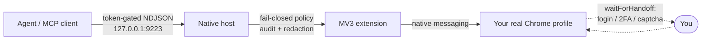

<div align="center">

# Chrome Bridge

**Chrome Native Messaging Automation Bridge**

**Hand an agent your real, logged-in Chrome. Keep local control.**

A custom MV3 extension plus a native-messaging host lets trusted local clients drive Chrome without `--remote-debugging-port` - no focus-stealing remote-debugging popup, no fresh automation profile, no cloud browser.

<p>
  <a href="https://github.com/wolfiesch/chrome-bridge/releases/latest"></a>
  <a href="https://github.com/wolfiesch/chrome-bridge/blob/main/LICENSE"></a>
  
  = 3.9">
  
</p>

</div>

---

Opening a browser is the easy part. The hard part is safely handing an agent your **existing signed-in Chrome session** - cookies, SSO, passkeys - without giving up local control. Chrome Bridge solves exactly that:

- **Fail-closed policy engine** in the native host - nothing runs without an explicit local grant
- **Confirmation tokens, response redaction, and a JSONL audit log** for every action
- **`waitForHandoff`** - the agent stops, focuses the real tab, and waits for you to do login, 2FA, captcha, or payment
- **Cooperative multi-agent leasing** so two agents never mutate one real profile at the same time

## How it works



Every raw TCP, CLI, and MCP request passes the same host policy engine. Payloads and response bodies never enter the audit log.

## 60-second quickstart

```bash
./setup.sh                              # installs native host, token, policy, extension dir
python3 test_client.py ping             # verifies the bridge
python3 test_client.py policyCheck getTabs '{}'   # verifies the policy engine
```

Then:

1. Open `chrome://extensions/`, enable Developer mode, **Load unpacked** from the directory printed by `setup.sh`.
2. Keep **only one** Chrome Bridge extension enabled - duplicates race to bind port 9223.
3. Optionally register the MCP server in your client config (Claude Desktop, Cursor, Cline):

```json
{
  "mcpServers": {
    "chrome-bridge": {
      "command": "uvx",
      "args": ["--from", "/ABSOLUTE/PATH/TO/CHECKOUT/mcp", "chrome-bridge-mcp"],
      "env": {
        "BRIDGE_REPO_ROOT": "/ABSOLUTE/PATH/TO/CHECKOUT",
        "BRIDGE_PORT": "9223"
      }
    }
  }
}
```

Requirements: Google Chrome (or Beta/Chromium) with Developer mode, Python 3.9+ (3.10+ for the MCP server), macOS or Linux for the documented installers. Broker mode is macOS-only (launchd).

## Why this over X

| Alternative | Difference |
|---|---|
| **Chrome DevTools MCP** | Requires a debuggable browser target and typically a remote-debugging port workflow. Chrome Bridge uses native messaging against your normal logged-in profile - no debug port, no focus-stealing popup. |
| **mcp-chrome-style bridges** | Chrome Bridge puts governance in the native host: fail-closed policy, action/origin checks, confirmation tokens, redaction, audit logs, and cooperative leases. |
| **Playwright / Puppeteer** | Excellent for isolated, purpose-launched contexts. Chrome Bridge is for real-profile work: existing cookies, SSO, passkeys, and human handoff when the agent should stop. |
| **Cloud browsers** | Browserbase/Steel-style services are remote and disposable. Chrome Bridge is local-first: browser state, tokens, screenshots, and audit data stay on your machine. |

## Features

| Category | What you get |
|---|---|
| **Browser control** | Navigation and history, tab lifecycle, waits, scrolling, screenshots, content extraction, keyboard/pointer, forms, file uploads, viewport, downloads, storage, geolocation |
| **Semantics** | `label=`, `text=`, `role=` selectors, open shadow DOM (`>>>`), iframe targets (`frame=... >> ...`), composite `batch` actions |
| **Emulation & diagnostics** | CPU/network throttling, color scheme, user agent, console/network capture, dialogs, request interception, performance metrics |
| **Real-profile moat** | `sessionStatus` redacted auth probe (cookie names/counts, never values) and `waitForHandoff` human-in-the-loop steps |
| **Governance** | Fail-closed `bridge_policy.json`, origin-aware checks on tab-scoped actions, deny/allow lists, confirmation tokens, optional macOS origin-approval prompt, `policy doctor` self-service |
| **Audit & redaction** | JSONL audit log (action/client/targets/decision/reason/request ID, never bodies); cookie, storage-state, and `redactPatterns` page-content redaction |
| **Multi-agent** | Named per-client tokens and a cooperative host-side lease with TTL, enforced before any action reaches the extension |
| **Self-healing** | Service worker stays alive via `chrome.alarms` + heartbeats; CLI auto-opens a wake page to recover after `ECONNREFUSED` |
| **Integrations** | MCP server with read-only/sensitive scoping and optional HTTP transport; GitHub attachment/comment helpers; benchmark harness; optional Rust native-host parity port |

> [!WARNING]
> **Trusted local use only.** Chrome Bridge controls your real Chrome profile: it can read page content, take screenshots, drive forms, download files, inspect cookies through redacted probes, attach Chrome's debugger, and run script/debugger actions when policy allows them. Install only on machines you control, and keep `bridge_token.txt`, `bridge_tokens.txt`, `extension_key.pem`, `bridge_policy.json`, and debug/audit logs private and git-ignored. Built-in host defaults are fail-closed: only `ping`, policy inspection, and lease actions work until a local policy opts into more.

## Command reference

`chrome-bridge <action>` below is shorthand for `python3 test_client.py <action>`; symlink it onto your `PATH` for the short form.

```bash
chrome-bridge navigate <url>
chrome-bridge screenshot <tabId> <outputPath>
chrome-bridge click <tabId> <selector>
chrome-bridge type <tabId> <selector> <text>
chrome-bridge waitForSelector <tabId> <selector> [timeoutMs]
chrome-bridge extractText <tabId> [maxChars]
chrome-bridge sessionStatus <domain> [...]
chrome-bridge waitForHandoff <message> [mode] [selectorOrUrlOrText] [timeoutMs] [tabId]
```

<details>
<summary><strong>Full command reference</strong> (core, tabs, waits, content, input, emulation, diagnostics, policy)</summary>

### Core

```bash
chrome-bridge ping
chrome-bridge getTabs
chrome-bridge getCookies <domain>
chrome-bridge executeScript <tabId> <code>
chrome-bridge executeScriptCDP <tabId> <code>
chrome-bridge observe <tabId>
```

### Navigation and tabs

```bash
chrome-bridge activateTab <tabId>
chrome-bridge closeTab <tabId>
chrome-bridge reload <tabId>
chrome-bridge goBack <tabId>
chrome-bridge goForward <tabId>
```

### Waits

```bash
chrome-bridge waitForLoad <tabId> [timeoutMs]
chrome-bridge waitForSelector <tabId> <selector> [timeoutMs]
chrome-bridge waitForText <tabId> <text> [timeoutMs]
chrome-bridge waitForUrl <tabId> <substring> [timeoutMs]
```

### Page state and content

```bash
chrome-bridge getCurrentState <tabId>
chrome-bridge screenshot <tabId> <outputPath>
chrome-bridge extractText <tabId> [maxChars]
chrome-bridge getHTML <tabId> <outputPath>
```

`screenshot` writes a PNG and prints path, MIME type, and byte count only. `getHTML` writes UTF-8 HTML to a file and prints path and byte count only.

### Pointer, keyboard, and forms

```bash
chrome-bridge click <tabId> <selector>
chrome-bridge type <tabId> <selector> <text>
chrome-bridge hover <tabId> <selector>
chrome-bridge scroll <tabId> <deltaX> <deltaY> [selector]
chrome-bridge press <tabId> <keySpec>
chrome-bridge drag <tabId> <fromSelector> <toSelector>
chrome-bridge fill <tabId> <selector> <text>
chrome-bridge select <tabId> <selector> <value>
chrome-bridge uploadFile <tabId> <selector> <path...>
chrome-bridge githubAttachUploadedFiles <tabId> <inputSelector> [formSelector] [timeoutMs]
chrome-bridge githubSubmitComment <tabId> [formSelector] [timeoutMs]
```

`type` focuses and inserts text; `fill` clears first. Input actions accept plain CSS plus semantic prefixes: `css=`, `label=`, `text=`, and `role=<role>[name=<accessible-name>]`. Use `<host> >>> <shadow-selector>` for open shadow DOM and `frame=<iframe-selector> >> <target-selector>` for iframes. `uploadFile` expands local paths and fails before contacting Chrome when any file is missing. The GitHub helpers avoid broad `executeScript*` access and verify the tab origin is `https://github.com`.

### Viewport and emulation

```bash
chrome-bridge setViewport <tabId> <width> <height> [deviceScaleFactor]
chrome-bridge setCpuThrottling <tabId> <rate>
chrome-bridge setNetworkConditions <tabId> <offline:0|1> [latencyMs] [downBps] [upBps]
chrome-bridge clearNetworkConditions <tabId>
chrome-bridge setColorScheme <tabId> light|dark|no-preference
chrome-bridge setUserAgent <tabId> <userAgent>
```

### Diagnostics, interception, downloads, storage, geolocation

```bash
chrome-bridge startMonitoring <tabId>
chrome-bridge stopMonitoring <tabId>
chrome-bridge consoleMessages <tabId>
chrome-bridge networkRequests <tabId>
chrome-bridge handleDialog <tabId> accept|dismiss [promptText]
chrome-bridge startInterception <tabId> <urlPattern> continue|abort|fulfill [status] [body]
chrome-bridge stopInterception <tabId>
chrome-bridge interceptedRequests <tabId>
chrome-bridge downloadUrl <url> [filename]
chrome-bridge storageState <tabId> <outputPath>
chrome-bridge setGeolocation <tabId> <latitude> <longitude> [accuracy]
chrome-bridge clearGeolocation <tabId>
chrome-bridge performanceMetrics <tabId>
```

`networkRequests` and `interceptedRequests` store URLs as origin plus pathname and report `hasQuery` instead of query strings. `startMonitoring`/`startInterception` leave Chrome's debugger attached until stopped. `downloadUrl` writes into Chrome's configured download location. `storageState` writes cookies/localStorage/sessionStorage to disk and prints metadata only.

### Policy self-service

```bash
chrome-bridge policyCheck <action> [payloadJson]
chrome-bridge policy info
chrome-bridge policy show
chrome-bridge policy doctor
chrome-bridge policy allow-action <action> [client]
chrome-bridge policy allow-origin <pattern> [client]
```

`policyCheck` reports what the host would decide (`allowed`, `reason`, `confirmationRequired`, `redact`, `audit`) without forwarding; tab-scoped actions include `originDependent: true` because the live tab origin is checked at forward time. `policy doctor` reads recent deny events from the audit log and proposes the precise fix for each.

### Raw-output safety

`getTabs`, `getCurrentState`, `extractText`, `getHTML`, `screenshot`, `consoleMessages`, `networkRequests`, `interceptedRequests`, and `storageState` can reveal private browsing context. Never paste raw cookies, tab URLs/titles, screenshot contents, HTML, or network URLs into transcripts unless the user explicitly asks; prefer redacted summaries (counts, names, domains).

</details>

<details>
<summary><strong>MCP server</strong> (tools, scoping, HTTP transport)</summary>

`mcp/` is a pure client of the token-gated TCP API; the extension, wire protocol, and host are unchanged. Tab-scoped tools take an optional `tab_id`; omit it to target the active tab.

| Group | Tools |
|---|---|
| **Read-only** | `browser_list_tabs`, `browser_snapshot`, `browser_extract_text`, `browser_screenshot`, `browser_get_html`, `browser_lease_status`, `browser_policy_check`, `browser_wait_for` |
| **Sensitive** (hidden by default) | `browser_get_cookies`, `browser_session_status`, `browser_action` (raw escape hatch) |
| **Mutating** | `browser_navigate`, `browser_click`, `browser_type`, `browser_fill`, `browser_hover`, `browser_scroll`, `browser_press`, `browser_drag`, `browser_select`, `browser_upload_file`, `browser_tab_control`, `browser_lease`, `browser_release`, emulation setters, `browser_wait_for_handoff`, `browser_confirm_action` |

Resources: `browser://tabs`, `browser://tab/{id}/state`. Tools carry `readOnly`/`destructive` annotations.

Scoping env flags: `BRIDGE_MCP_READONLY=1` hides everything mutating; `BRIDGE_MCP_ALLOW_SENSITIVE=1` exposes the sensitive group. These are usability scoping, not the security boundary - the host policy is.

Transport: stdio by default; `BRIDGE_MCP_TRANSPORT=http` serves streamable HTTP on `BRIDGE_MCP_HTTP_HOST`/`BRIDGE_MCP_HTTP_PORT` (default `127.0.0.1:8723`). Over HTTP all clients share one ambient bridge identity.

</details>

<details>
<summary><strong>Multi-client tokens and leasing</strong></summary>

`bridge_token.txt` is always accepted under the client name `default`. Optional `bridge_tokens.txt` lines of `name:token` register extra named clients; the matched token determines the client name. Both files are git-ignored secrets.

Three host-answered lease actions (also MCP tools `browser_lease`, `browser_release`, `browser_lease_status`):

- `lease` - optional `{"ttlMs": int}` (default 300000). Acquires when free, expired, or already yours; otherwise returns `leased by <owner>`.
- `release` - releases your lease; `not lease owner` when another client holds it.
- `leaseStatus` - non-mutating `{owner, expiresAt, now}` snapshot.

While a lease is live, every non-lease action from another client is rejected before forwarding, so the lease cannot be bypassed. Leases auto-expire. Python and Rust hosts implement this identically.

</details>

<details>
<summary><strong>Security model</strong></summary>

- TCP API is localhost-only and token-gated, but token holders bypass MCP scoping - `bridge_policy.json` (`BRIDGE_POLICY_FILE`) is the enforcement layer for every raw TCP/CLI/MCP client, applied before any action reaches the extension.
- Fail-closed defaults: with no valid policy, only `ping`, `policyCheck`, `policyInfo`, and lease actions are allowed. `setup.sh` copies `bridge_policy.example.json` to make automation an explicit opt-in.
- `requireConfirmation` actions return an opaque `confirmationToken`; resend through `browser_confirm_action` or `test_client.py confirm`. This is friction against accidental use, not protection from a compromised token holder.
- Origin policy applies to tab-scoped actions too: the host resolves the tab's live origin and evaluates policy before forwarding; unresolvable origins are denied.
- Python host only: `BRIDGE_POLICY_APPROVAL_MODE=gui` (macOS default) shows a native prompt when an action is blocked only by origin allow-listing - `Deny`, `Allow This Time` (TTL-bound one-shot grant), or `Always Allow` (persists to the local policy file).
- Audit log: JSONL at `bridge_audit.jsonl`, one event per request with `ts`, `client`, `action`, `targets`, `decision`, `reason`, `requestId`. Payload and response bodies are intentionally omitted.
- Redaction (on by default): cookie values and sensitive storage keys become `<redacted>`; page-derived content is masked against the policy's `redactPatterns` regexes.
- Python and Rust hosts enforce the same baseline policy/audit/redaction, covered by `verify_guardrails_contract.py`.
- `executeScript` uses `chrome.scripting` (MAIN world, subject to page CSP); screenshots, waits, emulation, monitoring, interception, and geolocation use `chrome.debugger`.
- The bridge intentionally lacks isolated browser contexts and multi-browser support: it controls the real profile. That ambient session is the point - it lets an agent reuse your logins and hand off to you for steps it should not do itself.

</details>

<details>
<summary><strong>Advanced setup</strong> (broker mode, store IDs, Rust host)</summary>

### Packaged / Web Store extension ID

```bash
./setup.sh --extension-id <id>
```

Registers an already-packaged or future Web Store extension ID separately, without generating a local extension key for the developer-mode unpacked copy. `extension_key.pem` is a private local identity key - keep it git-ignored.

### Launchd broker mode (macOS)

launchd keeps a small broker on public port `9223`; Chrome-launched native hosts bind backend port `19223`.

```bash
./setup-broker.sh --host python   # or: --host rust (after cargo build)
./uninstall-broker.sh             # disable
```

Verify with `launchctl print gui/$UID/gg.wolfie.chrome-native-bridge.broker` and `chrome-bridge ping`. Broker state lives under `~/Library/Application Support/chrome-native-bridge`; after migrating, load exactly the state-dir extension path printed by the installer.

### Rust host (parity port)

`host-rs/` is a behavior-identical Rust port of `bridge.py` - same extension, framing, and token-gated TCP API.

```bash
cargo build --release --manifest-path host-rs/Cargo.toml
./setup-rs.sh
PYTHONDONTWRITEBYTECODE=1 ./verify_rust_host.py
```

`setup-rs.sh` generates a `bridge-host-launch.sh` wrapper exporting the repo-root env paths. Only one host (Python or Rust) can own the `com.automation.bridge` registration at a time. The Rust host honors the same env vars plus `BRIDGE_POLICY_FILE` and `BRIDGE_AUDIT_LOG_FILE`.

</details>

<details>
<summary><strong>Benchmarking</strong> (harness, claim discipline)</summary>

The harness measures `chrome-bridge`, `playwright`, `puppeteer`, and `chrome-devtools-mcp` adapters against a local HTTP fixture (or `--base-url`):

```bash
python3 benchmark_harness.py run --adapter chrome-bridge --iterations 5 --output /tmp/chrome-bridge-results.json
python3 benchmark_harness.py run --adapter playwright --iterations 5 --output /tmp/playwright-results.json
python3 benchmark_harness.py compare --input /tmp/chrome-bridge-results.json --input /tmp/playwright-results.json --output /tmp/head-to-head.md
```

The harness talks over one keep-alive TCP connection instead of spawning the CLI per operation. Only rows marked `measured` in the generated report support speed claims; static metadata rows describe expected strengths and limits only. When publishing timings, keep the raw JSON and record source commit, host build, OS/hardware/browser versions, command lines, iterations, timeout/warmup policy, fixture URL, profile state, and run timestamp. Treat README examples and batching as capabilities, never as maintained speed evidence.

</details>

<details>
<summary><strong>Verification and release packaging</strong></summary>

Offline checks (no browser needed), from the repo root:

```bash
PYTHONDONTWRITEBYTECODE=1 ./verify_cli_contract.py
PYTHONDONTWRITEBYTECODE=1 ./verify_heartbeat_contract.py
PYTHONDONTWRITEBYTECODE=1 ./verify_broker_contract.py
PYTHONDONTWRITEBYTECODE=1 ./verify_bridge.py
PYTHONDONTWRITEBYTECODE=1 ./verify_benchmark_harness.py
PYTHONDONTWRITEBYTECODE=1 ./verify_moat_contract.py
PYTHONDONTWRITEBYTECODE=1 ./verify_guardrails_contract.py
PYTHONDONTWRITEBYTECODE=1 ./verify_install_contract.py
python3 benchmark_harness.py run --adapter noop --iterations 2 --output /tmp/results.json
node --check background.js && node --check wake.js
diff -q manifest.json extension/manifest.json && diff -q background.js extension/background.js
diff -q wake.html extension/wake.html && diff -q wake.js extension/wake.js
```

Manual live gates (open real Chrome tabs; the sample policy is fail-closed and denies loopback, so use an explicit smoke-test policy):

```bash
python3 test_client.py ping
PYTHONDONTWRITEBYTECODE=1 ./verify_live_install_smoke.py
PYTHONDONTWRITEBYTECODE=1 ./verify_agent_actions_live.py
PYTHONDONTWRITEBYTECODE=1 ./verify_capability_matrix.py
```

CI runs on pull requests and `main`; tags matching `v*` run the release workflow. Build local release artifacts with:

```bash
python3 scripts/package_release.py --version <version> --dist dist
```

</details>

<details>
<summary><strong>Troubleshooting</strong></summary>

The host writes a local `bridge_debug.log` (git-ignored) next to `bridge.py`.

| Symptom | Fix |
|---|---|
| `Connection refused` (direct mode) | Chrome closed, no bridge extension enabled, or service worker asleep. The CLI tries one wake via `chrome-extension://<id>/wake.html`; override with `BRIDGE_WAKE_DISABLED`, `BRIDGE_EXTENSION_ID`, `BRIDGE_WAKE_COMMAND`. |
| `Connection refused` (broker mode) | Broker not loaded: `launchctl print gui/$UID/gg.wolfie.chrome-native-bridge.broker`. |
| `broker backend unavailable` | Broker up, but Chrome/extension/host did not wake in time. Reload the extension; check `broker_debug.log` and `bridge_debug.log`. |
| `FATAL: could not bind 127.0.0.1:9223` | Two direct-mode bridge extensions enabled, or direct mode racing the broker. |
| `unauthorized` | Token mismatch or wrong extension ID in the host manifest. Re-run `./setup.sh`, reload the printed extension dir, disable duplicates. |

</details>

<details>
<summary><strong>Repository layout</strong></summary>

```text
chrome-native-bridge/
├── extension/                          <- public unkeyed extension source copy
├── background.js                       <- editable service-worker source
├── wake.html / wake.js                 <- wake page for suspended-worker recovery
├── manifest.json                       <- public unkeyed source manifest
├── extension_identity.py               <- local key and extension ID helper
├── bridge.py                           <- native host (Python reference)
├── host-rs/                            <- Rust native-host parity port
├── broker.py                           <- opt-in launchd TCP broker for stable port 9223
├── bridge_policy.example.json          <- explicit opt-in policy template
├── com.automation.bridge.json.template <- host-manifest template
├── setup.sh / setup-rs.sh              <- token/policy/extension/host installers
├── setup-broker.sh / uninstall-broker.sh
├── bridge_wake.py                      <- wake-page discovery/opening helper
├── test_client.py                      <- CLI client
├── mcp/                                <- MCP server
├── benchmark_harness.py                <- benchmark and comparison harness
├── usage_telemetry.py                  <- local-only usage diagnostics
├── scripts/package_release.py          <- stdlib release packager
└── verify_*.py                         <- offline contracts and live gates
```

</details>

## Repository naming

The canonical public repository is [`wolfiesch/chrome-bridge`](https://github.com/wolfiesch/chrome-bridge); the product name is **Chrome Bridge**. Your local checkout folder may have another name - replace `/ABSOLUTE/PATH/TO/CHECKOUT` in examples with your actual checkout path.

## License

[MIT](LICENSE)
